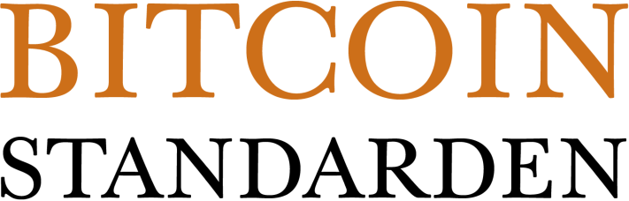
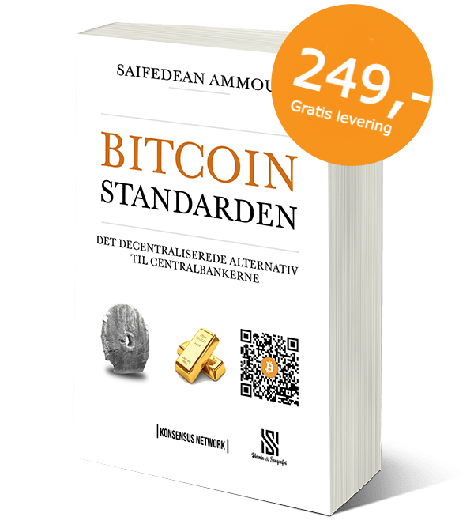

Dr. Saifedean Ammous’ mesterværk “The Bitcoin Standard” er nu endeligt ude på dansk. Den engelske version er **#1 Bestseller** på Amazon.com med en rating på _4.7 ud af 5_.

> Denne bog er skrevet for at hjælpe læseren med at forstå økonomien bag bitcoin, og hvordan bitcoin tjener som den digitale udgave af de mange teknologier, der historisk har været brugt til at udføre penges funktioner. Denne bog er ikke en reklame eller opfordring til at investere i bitcoin. Langt fra.

— _Uddrag fra forfatterens prolog._ [Læs hele prologen her](/prolog/).

**Gratis levering!**
-----------------------------------------

Køb bogen hos _[SHOP21.DK](https://shop21.dk/vare/bitcoinstandarden/)_**,** hvor Du kan betale med Bitcoin, mobilepay eller betalingskort.

> _Bitcoinstandarden_ bør være påkrævet læsning for alle i nutidens samfund. Den giver en kortfattet og sammenhængende fortælling om monetær teori, historien om penge, praktisk økonomi, og politisk påvirkning af erhvervsliv, kultur og økonomi.

— _Uddrag Fra forordet af Michael Saylor, CEO for MicroStrategy._  [Læs hele forordet her](/forord/).

Hvorfor oversætte bogen til dansk?
----------------------------------

Efter at have læst _Bitcoinstandarden_ på engelsk, forstod vi, hvorfor bitcoin er helt speciel og værd at bruge tid på. For at flere kunne få glæde af dens budskab, valgte vi at oversætte den til dansk.
Læs mere [her](/om/).

Bogen er oversat af [Rasmus Hansen](https://twitter.com/rasmushansen) & Pierre Vendelboe.

Mere om bitcoin på dansk
------------------------

Vi har samlet [links til andre danske resourcer](/danske-bitcoin-links/).

Kontakt os
----------

Har du nogle spørgsmål, kommentarer, ideer eller andet, er du velkommen til at kontakte holdet bag bogen på [info@bitcoinstandarden.dk](mailto:info@bitcoinstandarden.dk).